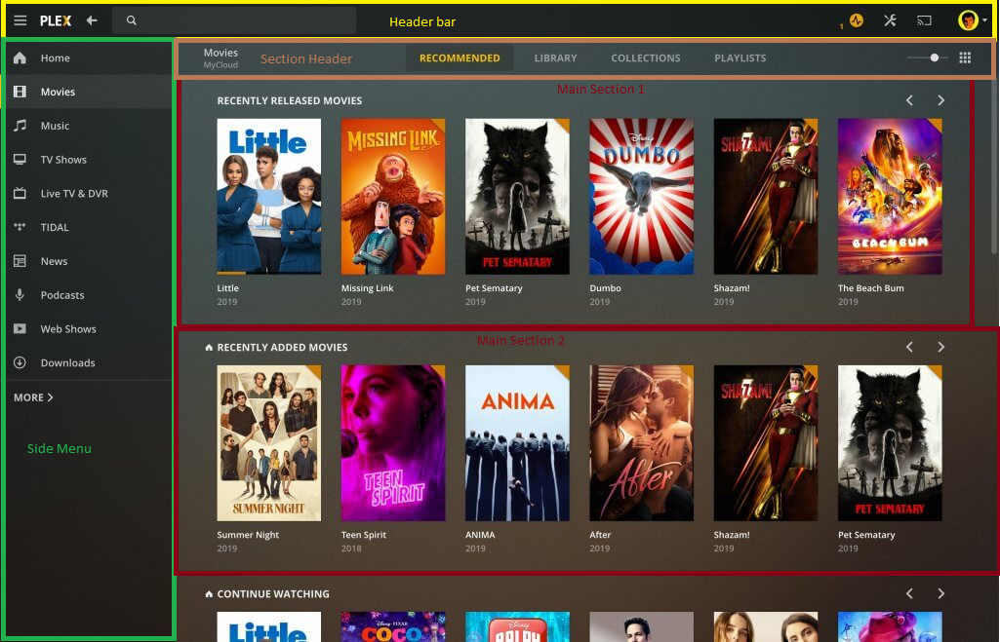

# 3dev-fullstack
learn fullstack! (MERN Stack)
## goal of this repository (vision)
create a plex-like book library, with multiple books and user authentication, and even more to come...

## contribute
If you have spare time, you can always make an addition to the system! If you have something different in mind than the listed additions below, just DM @kwlski on DC.
### how to
- implement one of the possible additions below, if you are a beginner I can help you getting your changes to github
- push your feature to a non protected branch
- open a pullrequest on github, that can be reviewed and merged into the "master" branch
### possible additions (topdown order)
#### documentation
- add a description for setting up the project as it is now, make a summary/guide of what we have done so far. See [Issue #1](https://github.com/threedevs/3dev-fullstack/issues/1)
- document the possible API Routes for our library, consisting of users and books so far, use this readme file
#### frontend
##### beginner
- **[in work, see [Issue #2](https://github.com/threedevs/3dev-fullstack/issues/2)]** make a prototype with a free tool, for example draw.io, figma or justinmind, try to immitate plex, but with books!
- add a "theme.md" file, where you describe the maintheme as well as its colors, define a primary color, secondary color and background color, follow https://material.io/design/color/the-color-system.html#color-theme-creation , take the plex picture as an example and its buttons if you are unsure
- add a new html file "about.html" and add a description of what the goal is of this repository as well as who has/will/want contribute to it, the html does not need to be accessible yet, just a seperate file, you can add as many things as you like, as long as its about us, does not need to be responsive
- add styling to the "about.html", you can do whatever you like, as long as its in line with "theme.md"
- add a new html file "login.html" add 2 inputs and a login button, does not need to be responsive
- add sytling to the "login.html", you can do whatever you like, as long as its in line with "theme.md"
- add a new html file "layout.html" as a boilerplate for our layout of all pages, you can implement it as a standalone html file for now that can be merged for layouting, have a horizontal header bar, a main section, and a vertical left side menu bar, does not need to be responsive, you can take the plex picture as example
- add styling to "layout.html", you can do whatever you like, as long as its in line with "theme.md"
- add a "books.html" that contains  3 "pseudo books", it should contain a list of books with a cover, the goal is it to be like the "Main Section 1" on the picture, does not need to be responsive
- add sytling to the "books.html",  it needs to be in line with "theme.md"
##### intermediate
- take one of the created pages from the beginner part and make it responsive, should work on every device, do not use bootstrap
- add clientside/javascript validation to the "login.html", set the password requirements yourself, document them accordingly in the readme
- perform a login towards the server with fetch(), try to figure out what url will be used, if not given any yet just make up a url, get in contact with one of the backend devs or create a route yourself if you feel like it!
- take an existing page and link it to the layout, so that its reachable through navigation
##### advanced
- add a "create react app" boilerplate, use the frontend folder as root, so that we can later merge our html pages into our react application
- use the login form "login.html" that hits our register route with fetch, make the clientside work as well as the serverside
- ...more to come
#### node
##### beginner
- make a "routes.md" file, define what requests hit which resources with what methods, for the resources "books" and "users"
- think of the system as a whole, be creative, what could be added to the library in terms of functionality? We only have books and users for now... Add a file that describes what the addition does and what is needed for it.
- start commenting the server.js code and what it does, so people understand what we are doing
- start commenting the existing routes in JSDoc style, explain what they do
##### intermediate
- add proper validation for user creation (register)
- add a library/package that documents our code with our given comments on functions, f.e. JSDoc
- add mongoose database queries for the other routes
- make self-written tests for our backend, you can use supertest for this or f.e. "node-fetch" which works like fetch on the client
##### advanced
- add scalability for validation in a seperate middleware, maybe third party library? For example Express-Validator
- add scalability for multiple routes and its CRUD and other operations
- add an API documentation generator f.e. something like Swagger
- add users route (CRUD)
- add books route (CRUD)
- add authentication routes (login, register)
- add API tests to all our routes
- ...more to come

##### refactor/merge
- ...more to come

## how to use the repository
### 1. first you will need to install git and node
```
https://git-scm.com/downloads
https://nodejs.org/en/
```
### 2. clone the repository
now you can use git to clone this repository and get it so you have it locally on your machine as physical files
for this go to your desired directory where you want to have your files and run the following command
```
git clone https://github.com/threedevs/3dev-fullstack.git
```
you should now see a folder 3dev-fullstack
### 3. install the dependencies
open the folder 3dev-fullstack and install the packages that we need with following command from the npm registry
```
npm i
```
### 4. run the server
now you should be able to run the node server with nodemon which keeps track of changes and restarts the server if needed
```
nodemon server
```
### 5. run the frontend
now we can try using our server, for this open the frontend folder and run index.html in any way
### 6. done!

## prerequisites for the current system, to make the backend work (not needed for frontend)
- install mongodb on your system
- install mongo compass on your system
- connect with mongodb compass to your local mongodb server, you might need to start it first!
- add database with name "library" to your local mongodb server
- add collection with name "books" to your "library" database
- add collection with name "users" to your "library" database
## code documentation
### Prototype
```
https://www.figma.com/file/XIUfEV7DlJHJCxwN8BAz5U/Library?node-id=1%3A3
```
### API routes
...
### technology stack
...
### contributors
...
